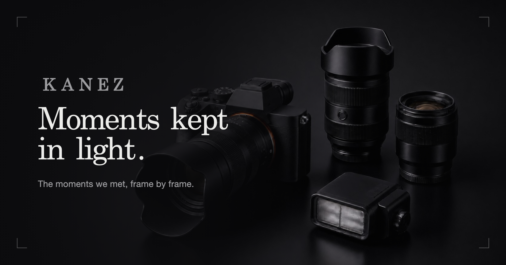

# Moments Kept in Light

**빛으로 남긴 순간들** — 행사와 개인 촬영을 위한 미니멀 다크 포토 포트폴리오

브라우저에서 사진을 직접 올리고 관리하는 웹 관리자와 Cloudflare 기반 저장소를 갖춘 자체 제작 사이트입니다.

 

### [라이브 사이트 바로가기 →](https://moments-in-light.phtkanez.workers.dev)

---

## 현재 구조

사이트에서 말하는 컬렉션은 최상위 촬영 단위입니다. 컬렉션 안에서 촬영 유형을 다음처럼 구분합니다.

- **Event** — 행사에서 여러 모델을 촬영한 묶음입니다. 사람별 폴더와 많은 사진을 중심으로 보여줍니다.
- **Personal Session** — 행사 중 개인 촬영을 포함한 야외·스튜디오 등 소규모 촬영입니다. 한 명 또는 적은 인원의 사진을 위한 별도 레이아웃을 사용합니다.

개인 세션은 행사 아래에 종속되는 하위 앨범이 아닙니다. 행사와 나란한 컬렉션이며, 필요할 때 관련 행사 컬렉션을 연결해 출처를 표시합니다. 장소 유형은 행사장, 야외, 스튜디오로 저장할 수 있습니다.

## 주요 기능

### 방문자 화면

- 다크 에디토리얼 갤러리
- 홈에서 Events와 Personal Sessions를 분리해 표시
- 관리자 설정에서 두 섹션의 순서를 Events 먼저 또는 Personal Sessions 먼저로 선택
- 행사 카드는 대표 이미지와 최대 3장의 미리보기 스트립을 함께 표시
- 개인 세션 카드는 대표 이미지 중심으로 표시해 적은 사진도 가로로 비어 보이지 않게 구성
- 각 섹션은 앨범 개수가 아니라 화면상의 높이 기준으로 접습니다. 접힌 경계 아래는 점진적인 페이드와 블러로 처리하고, 흰색 화살표를 누르면 자연스럽게 펼치거나 다시 접습니다.
- 행사 상세는 기존의 사람별 폴더 구조를 유지
- 개인 세션 상세는 대표 사진 1장과 에디토리얼 2열 갤러리로 표시하며, 모바일에서는 1열로 전환
- 관련 행사가 연결된 개인 세션에서는 행사 상세로 돌아가는 링크 표시
- 컬렉션 / 모델 / 작품·캐릭터 / 전체 사진의 네 가지 탐색 방식
- 전체 검색: 행사, 작품, 캐릭터, 모델 및 관리자 별칭
- 한국어 통칭 별칭 검색 지원
- 시네마틱 인트로와 반응형 레이아웃

### 관리자 화면

관리자 주소는 사이트 주소 뒤에 /admin을 붙입니다.

- 비밀번호 로그인과 세션 관리
- Event 또는 Personal Session 유형으로 새 컬렉션 생성
- 촬영 장소 유형과 관련 행사 지정
- 드래그&드롭 업로드
- 브라우저에서 large / medium / thumbnail WebP 생성 및 EXIF 추출
- X 게시물에서 사진 가져오기와 모델·캐릭터 정보 파싱
- 사람별 폴더 생성, 이름·계정·캐릭터 메타데이터 편집
- 사진 및 폴더 순서 드래그 정렬
- 컬렉션 대표 사진, 메인 슬라이드, 작품 대표 사진 지정
- 컬렉션 공개·비공개 전환
- 여러 사진 일괄 이동·삭제
- 오래된 사진의 medium 변형을 브라우저에서 다시 생성하는 중간 크기 채우기
- 검색 별칭과 모델 이름 관리
- 휴지통 이동, 복구, 보관기한 이후 영구 삭제
- D1 메타데이터와 R2 사진을 별도 백업 버킷에 저장하고 최근 백업을 복원

## 관리자 기본 사용법

1. 관리자 화면에서 새 컬렉션을 만듭니다.
2. 행사 사진이면 Event, 개인 촬영이면 Personal Session을 선택합니다.
3. 장소 유형을 행사장·야외·스튜디오 중에서 지정합니다.
4. 행사 중 진행한 개인 촬영이라면 Personal Session에 관련 Event 컬렉션을 연결합니다.
5. 사진을 올린 뒤 사람별 폴더, 캐릭터, 대표 사진과 정렬 순서를 정리합니다.
6. 정리가 끝난 컬렉션만 공개로 전환합니다.
7. 사이트 설정에서 홈의 Events / Personal Sessions 순서를 선택할 수 있습니다.
8. 중요한 변경 전에는 관리자 화면에서 백업을 실행하고 복원 가능 여부를 확인합니다.

## 기술 스택

| 영역 | 사용 기술 |
|------|-----------|
| 서버 | Cloudflare Workers + Hono |
| DB | Cloudflare D1 (SQLite) |
| 사진 저장소 | Cloudflare R2 |
| 프론트 | Vanilla JavaScript SPA, 해시 라우팅 |
| 정적 파일 | Workers Assets |
| 배포 | Wrangler |
| 테스트 | Vitest + Cloudflare Workers pool |

## 프로젝트 구조

    src/worker.js                    # Hono 백엔드, API, 인증, 이미지 프록시, OG 메타 주입
    migrations/                      # D1 스키마 변경
      0008_collection_types.sql      # 행사·개인 세션·장소·관련 행사
    public/
      index.html                     # 방문자 SPA 셸
      app.js                         # 라우터, 홈, 컬렉션 상세, 검색, 라이트박스
      admin.html                     # 관리자 SPA 셸
      admin.js                       # 업로드·메타데이터·백업·관리 기능
      style.css                      # 다크 에디토리얼 테마와 반응형 레이아웃
      config.js                      # 사이트 이름·문구·연락처 설정
    wrangler.jsonc                   # Worker, D1, R2, Assets 바인딩
    test/worker.test.js              # Worker API 및 D1/R2 동작 테스트

## 로컬 개발

    npm install
    npx wrangler d1 migrations apply DB --local
    npx wrangler dev --port 8787

로컬 관리자 비밀번호는 프로젝트 루트의 .dev.vars에 설정합니다. 이 파일은 Git에 올라가지 않습니다.

    ADMIN_PASSWORD=your-dev-password

로컬 D1과 R2 상태는 Wrangler의 .wrangler/state 아래에 저장됩니다. 로컬 사진 데이터는 운영 Cloudflare 데이터와 자동으로 동기화되지 않습니다.

## 배포

최초 1회 Cloudflare 인증을 진행합니다.

    npx wrangler login

운영 D1 마이그레이션을 먼저 적용한 뒤 Worker를 배포합니다.

    npx wrangler d1 migrations list DB --remote
    npx wrangler d1 migrations apply DB --remote
    npx wrangler deploy

이 저장소의 운영 바인딩은 wrangler.jsonc의 DB, PHOTOS, BACKUPS, ASSETS입니다. 기존 운영 DB가 런타임 부트스트랩으로 만들어진 경우에는 마이그레이션 기록과 실제 스키마가 다를 수 있으므로, 목록을 확인하지 않고 예전 마이그레이션을 강제로 재적용하지 않습니다.

사진 파일과 컬렉션 데이터는 코드 배포에 포함되지 않습니다. 사진은 관리자 화면에서 운영 D1/R2에 별도로 업로드해야 합니다.

프로덕션 관리자 비밀번호는 secret으로 관리합니다. 비밀번호를 설정 파일이나 Git에 저장하지 않습니다.

    npx wrangler secret put ADMIN_PASSWORD

## 검증

    npm test
    npm run types
    npx wrangler deploy --dry-run

운영 확인은 다음 계층을 나누어 진행합니다.

- 코드·API: 테스트와 공개 API 응답
- 배포: Wrangler의 업로드·Worker 버전·바인딩 결과
- 실제 페이지: 운영 URL의 HTML, JavaScript, 이미지와 컬렉션 표시
- 데이터: 운영 D1/R2에 실제로 존재하는 컬렉션과 사진

/api/health는 별도로 구현된 경로가 아니므로 서비스 상태 확인 주소로 사용하지 않습니다. 공개 컬렉션 API와 실제 페이지를 기준으로 확인합니다.

## 문서

- 처음부터 따라 하는 설치 가이드: [SETUP.md](SETUP.md)
- 배포와 기능 변경 내역: [CHANGELOG.md](CHANGELOG.md)

---

사진 저작권은 촬영자에게 있습니다 — 사용 전 문의 부탁드립니다.
코드는 포트폴리오 참고용으로 공개합니다.

